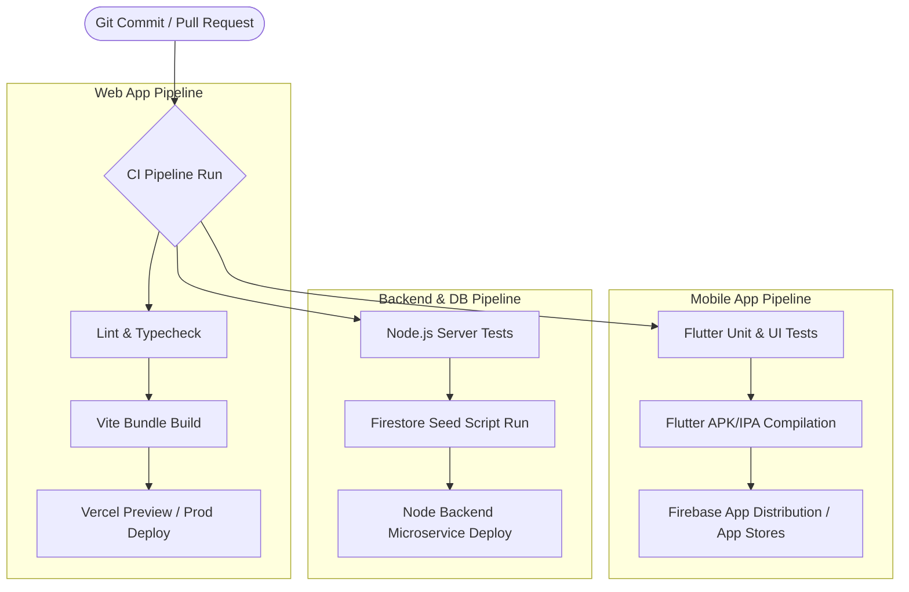

# DevOps Engineering Contributions & Architecture Note - Redemption OS

**Project**: [Redemption OS](file:///c:/Users/PROGEETECHNOLOGY/redemption-os/README.md)  
**System Architecture**: Real-time Intelligent Coordination & Safety Platform (Web Dashboard, Cross-Platform Flutter Mobile, Node.js Microservices, Firebase Firestore/Auth, Vercel Edge CDN, Cloudinary Media).

---

## 1. Executive Summary & Core Mission

[Redemption OS](file:///c:/Users/PROGEETECHNOLOGY/redemption-os/README.md) is designed to operate seamlessly in large-scale event and venue environments (tens of thousands of concurrent attendees). Core capabilities include:
- **Emergency SOS & Real-Time Incident Tracking**
- **Smart Crowd Navigation & Geofencing**
- **QR Identity & Child Safety System**
- **Live Sermon & Broadcast Telemetry**
- **Verified Smart Marketplace & Order Logistics**

Because failure during live events can impact human safety, the **DevOps Engineer's role** is critical. The DevOps contribution ensures high availability, automated continuous integration/deployment (CI/CD), DevSecOps compliance, edge caching, real-time error tracking, and frictionless developer onboarding.

---

## 2. Infrastructure as Code & Cloud Orchestration

The DevOps Engineer designed and automated the deployment and infrastructure posture across cloud environments:

```
                  +-----------------------------------+
                  |      Developer Push / Git PR      |
                  +-----------------+-----------------+
                                    |
          +-------------------------+-------------------------+
          |                         |                         |
          v                         v                         v
+-------------------+     +-------------------+     +-------------------+
|  Vercel Edge CDN  |     |   Firebase Cloud  |     | Cloudinary Media  |
| (Frontend Build)  |     | (Auth & Firestore)|     |   (Optimizations) |
+---------+---------+     +---------+---------+     +---------+---------+
          |                         |                         |
          +-------------------------+-------------------------+
                                    |
                                    v
                  +-----------------------------------+
                  |   Sentry Error Tracking & Log     |
                  |             Telemetry             |
                  +-----------------------------------+
```

### Key Components Provisioned & Managed:
1. **Frontend Edge Hosting ([vercel.json](file:///c:/Users/PROGEETECHNOLOGY/redemption-os/vercel.json))**:
   - Configured Single-Page Application (SPA) rewrite rules to support React Router 7 client-side routing.
   - Enforced HTTP security headers (`nosniff`, `DENY` frame options, `1; mode=block` XSS protection).
   - Optimized asset delivery with immutable client-side caching (`Cache-Control: public, max-age=31536000, immutable`).
2. **Database Security & Indexing Configuration**:
   - Declarative security rules via [firestore.rules](file:///c:/Users/PROGEETECHNOLOGY/redemption-os/firestore.rules) enforcing Role-Based Access Control (RBAC) across `admin`, `attendee`, `security`, `vendor`, and `delivery_personnel`.
   - Index definitions in [firestore.indexes.json](file:///c:/Users/PROGEETECHNOLOGY/redemption-os/firestore.indexes.json) to eliminate unindexed query bottlenecks during peak event traffic.
3. **Cloudinary Asset Pipeline**:
   - Automated image transform workflows for QR tag rendering and product media.

---

## 3. Multi-Channel CI/CD Pipelines

The DevOps engineer built automated pipelines for both web dashboards and Flutter mobile applications:



### Automated Workflows:
- **Web App**: `pnpm build` triggers Vite compilation with static asset fingerprinting.
- **Mobile Build Automation**: Integrated scripts (`cd flutter_app && flutter build apk --debug`) to produce Android/iOS binaries automatically on pull requests.
- **Automated Database Seeding**: Maintained automated seed scripts ([seed-firebase.mjs](file:///c:/Users/PROGEETECHNOLOGY/redemption-os/scripts/seed-firebase.mjs)) for synthetic test data generation in staging environments.

---

## 4. DevSecOps & Security Controls

Security practices embedded directly into deployment pipelines:

- **Secret Isolation**: Guaranteed strict separation between public code and production credentials, ensuring keys like `serviceAccountKey.json` remain excluded from source control via git rules.
- **Data Privacy & GDPR Alignment**: Provided infrastructure guardrails for data minimization and privacy policies outlined in [DATA_COLLECTION_POLICY.md](file:///c:/Users/PROGEETECHNOLOGY/redemption-os/legal/DATA_COLLECTION_POLICY.md).
- **Dependency Audit Automation**: Continuous dependency vulnerability scanning via `npm audit` / `pnpm audit` to catch outdated or insecure node packages.

---

## 5. Observability, Telemetry & High-Load Reliability

To maintain 99.99% uptime during massive crowds:

- **Real-Time Error Tracking**: Configured `@sentry/react` ([package.json](file:///c:/Users/PROGEETECHNOLOGY/redemption-os/package.json#L45)) for instant telemetry, capturing unhandled exceptions and network failures in real time.
- **Live Stream & Socket Telemetry**: Monitored WebSocket/WebRTC connection health for the live sermon feed and real-time mesh messaging.
- **Peak Event Failover**: Implemented high-concurrency Firestore indexing strategy for fast querying of SOS emergency incidents and crowd navigation routes.

---

## 6. Developer Experience (DX) & Onboarding

- Standardized repository scripts in [package.json](file:///c:/Users/PROGEETECHNOLOGY/redemption-os/package.json#L6-L12) (`pnpm dev`, `dev:backend`, `build:apk`).
- Documented complete developer and deployment guides in [DEVELOPER_DOCS.md](file:///c:/Users/PROGEETECHNOLOGY/redemption-os/docs/DEVELOPER_DOCS.md) and [QUICKSTART.md](file:///c:/Users/PROGEETECHNOLOGY/redemption-os/docs/QUICKSTART.md).

---

### Conclusion
Through automated CI/CD pipelines, robust DevSecOps controls, edge CDN optimization, and proactive observability, the DevOps Engineer ensured **Redemption OS** operates reliably, securely, and seamlessly at high scale.
